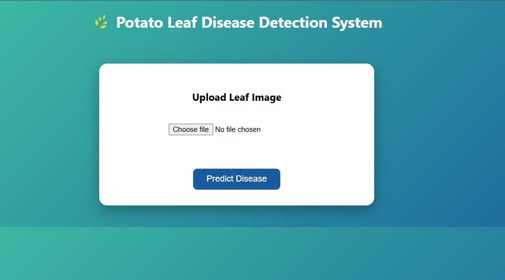
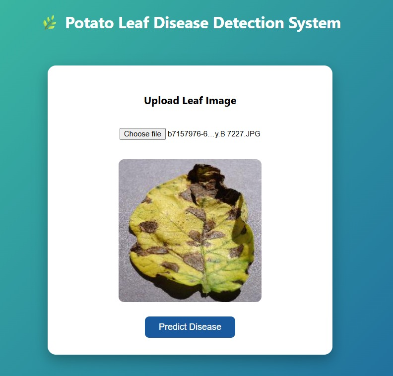
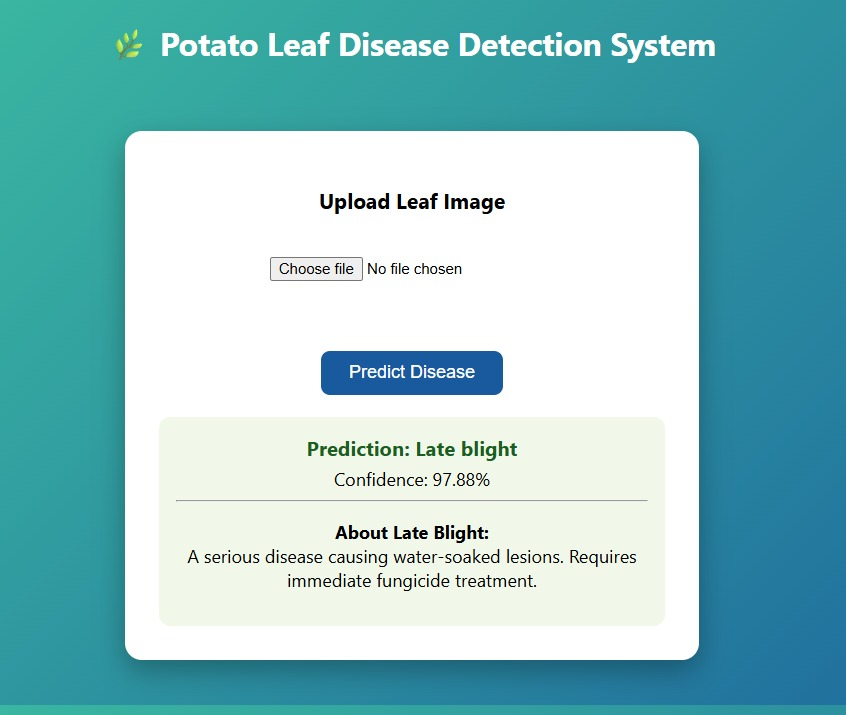

# 🌿 Potato Leaf Disease Detection 🥔

Deep Learning based Potato Leaf Disease Detection System using CNN and TensorFlow/Keras.

---

# 📖 About Project

This project is a Deep Learning based web application that detects potato leaf diseases using Convolutional Neural Networks (CNN).  
Users can upload potato leaf images and the system predicts whether the leaf is:

- Potato Early Blight
- Potato Late Blight
- Healthy Potato Leaf

---

# 📂 Project Structure

```bash
Potato_Leaf_Disease/
│
├── dataset/
│
├── model/
│
├── static/
│
├── templates/
│
├── app.py
├── train_model.py
├── potatoes.h5
├── requirements.txt
└── README.md
```

---

# 🛠️ Tech Stack

| Layer | Technology |
|--------|-------------|
| Frontend | HTML, CSS |
| Backend | Flask (Python) |
| Deep Learning | TensorFlow / Keras |
| Image Processing | OpenCV |
| Numerical Computing | NumPy |
| Model Type | CNN |

---

# ✨ Features

- ✅ Detects Potato Early Blight
- ✅ Detects Potato Late Blight
- ✅ Detects Healthy Potato Leaves
- ✅ CNN based Deep Learning Model
- ✅ Upload Image and Predict Disease
- ✅ Simple and Responsive UI

---

# 📊 Dataset

Dataset used from Kaggle PlantVillage:

https://www.kaggle.com/datasets/emmarex/plantdisease

### Classes Used

- Potato___Early_blight
- Potato___Late_blight
- Potato___healthy

---

# 🚀 Installation & Setup

## 1️⃣ Clone Repository

```bash
git clone https://github.com/your-username/potato-leaf-disease-detection.git
```

---

## 2️⃣ Navigate to Project Folder

```bash
cd potato-leaf-disease-detection
```

---

## 3️⃣ Install Dependencies

```bash
pip install -r requirements.txt
```

---

## 4️⃣ Run Application

```bash
python app.py
```

---

# 🧠 Train Model

To train the CNN model:

```bash
python train_model.py
```

The trained model will be saved as:

```bash
potatoes.h5
```

---

# 📸 Project Screenshots

## 🏠 Home Page



---

## 🔍 Prediction Result



---


# 👩‍💻 Author

Zayanah Khan
